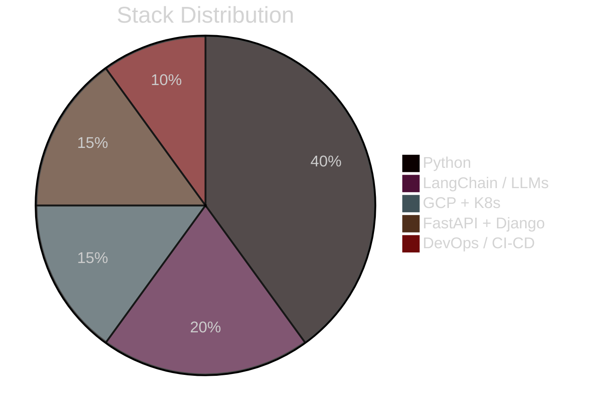

<!-- ======  Syed Muhammad Bahjat  ====== -->
<h1 align="center">
  <!-- wider canvas + longer duration so every letter finishes -->
  
</h1>

  
  
  
  

---

### 🔬 Tech DNA (static, always visible)

---

### 🛠️ Core Arsenal

| **Domain**        | **Tools & Frameworks** |
|-------------------|------------------------|
| **AI / ML**       | LangChain • Vertex AI • OpenAI • RAG • Pinecone/FAISS • PyTorch • TensorFlow • Whisper |
| **Backend**       | Python • Django REST Framework • FastAPI • PostgreSQL • MongoDB • Redis • Celery |
| **Cloud & MLOps** | GCP (GKE, Cloud Run, Vertex AI) • AWS (EKS, S3, Lambda) • Kubernetes • Docker • GitHub Actions |
| **Automation**    | Selenium • Playwright • Twilio • WhatsApp API • Email & Chatbot pipelines |

---

### 🚀 Featured Projects (GIFs replaced with emoji + short clips)

| Project | Tech | One-liner |
|---------|------|-----------|
| 🤖 **AI Personal Assistant** | Twilio, LangChain, Gmail API, OpenAI | WhatsApp & email bot that schedules meetings, parses docs, and boosts productivity by 40 %. |
| 📞 **Voice Agent (1 k+ calls/day)** | Retell AI, Bland, FastAPI, PostgreSQL | Autonomous voice agent scraping real-estate leads and qualifying clients in real time. |
| 🍽️ **Smart Waiter Robot (FYP)** | Raspberry Pi, LiDAR, SLAM, React | Autonomous restaurant robot that maps tables and delivers food via web orders. |

> 📄 Detailed case-studies & notebooks: [syedmbahjat848@gmail.com](mailto:syedmbahjat848@gmail.com) (happy to share privately).

---

### 📈 Stats without public repos

<!-- compact skill icons instead of repo cards -->

---

### 📈 GitHub Stats

---

### 🏆 Trophy Rack

---

### 🎯 Currently Exploring
* **Self-correcting RAG pipelines** with LangGraph & LangSmith
* **Finetuning Whisper** for low-resource Urdu audio
* **Vertex AI Reasoning Engine** + Gemini for real-estate lead-gen

---

### 📬 Let’s Build Something

